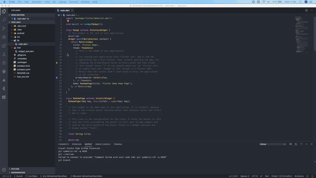
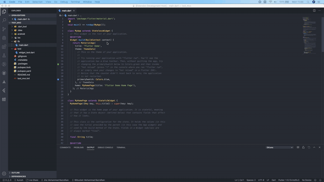
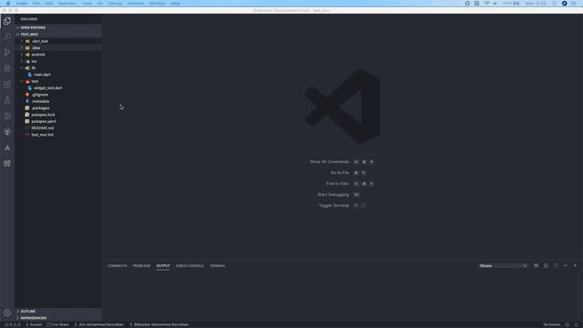
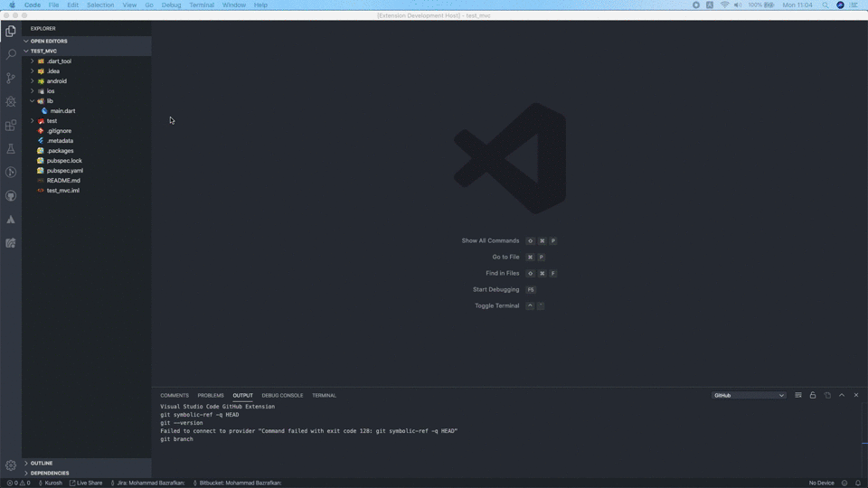
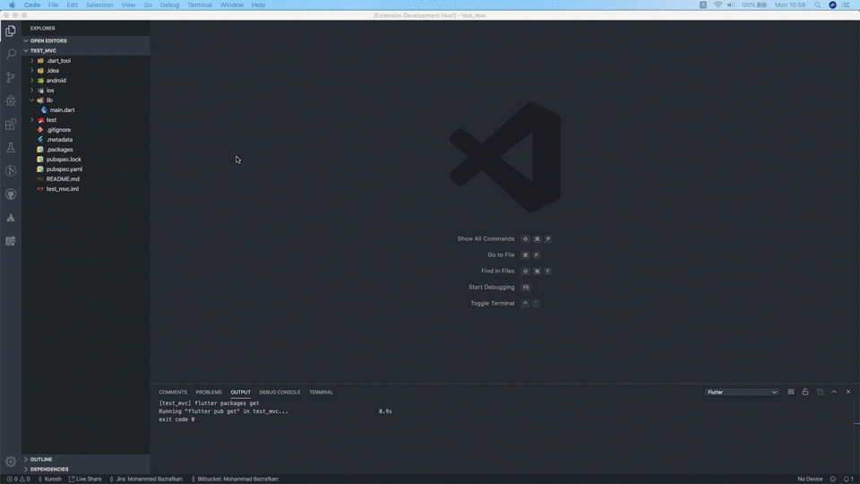
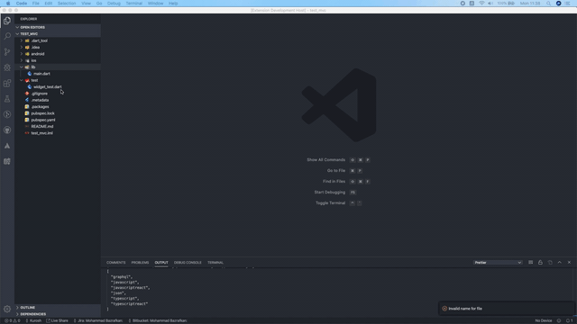

[](https://flutter.dev)
[](LICENSE)

# Flutter MVC Architecture Generator [](https://marketplace.visualstudio.com/items?itemName=Kurosh.flutter-mvc-generator)

VsCode extension to generate boilerplate code when using using [providers](https://pub.dev/packages/provider)

## Features

### Create MVC

The create MVC command or menu will add a **MVC**.






#### Example

If you give parameter for class name as `home`, the extension will create a directory structure like this

```bash
--root
    |-- android
    |-- ios
    |-- lib
        |-- models
            |-- home
                |-- home_model.dart
        |-- views
            |-- home
                |-- home_view.dart
        |-- controllers
            |-- home
                |-- home_controller.dart
        |-- main.dart
    |-- test
    |-- pubspec.yaml
```

It will also add the following dependencies to the `pubspec.yaml` file

- provider: ^4.0.2

### Create Model

The create model command or menu will add a **Model**.




#### Example

If you give parameter for class name as `home`, the extension will create a directory structure like this

```bash
--root
    |-- android
    |-- ios
    |-- lib
        |-- models
            |-- home
                |-- home_model.dart
        |-- main.dart
    |-- test
    |-- pubspec.yaml
```

It will also add the following dependencies to the `pubspec.yaml` file

- provider: ^4.0.2

### Create View

The create view command or menu will add a **View**.





#### Example

If you give parameter for class name as `home`, the extension will create a directory structure like this

```bash
--root
    |-- android
    |-- ios
    |-- lib
        |-- views
            |-- home
                |-- home_view.dart
        |-- main.dart
    |-- test
    |-- pubspec.yaml
```

It will also add the following dependencies to the `pubspec.yaml` file

- provider: ^4.0.2

### Create Controller

The create controller command or menu will add a **Controller**.




#### Example

If you give parameter for class name as `home`, the extension will create a directory structure like this

```bash
--root
    |-- android
    |-- ios
    |-- lib
        |-- controllers
            |-- home
                |-- home_controller.dart
        |-- main.dart
    |-- test
    |-- pubspec.yaml
```

It will also add the following dependencies to the `pubspec.yaml` file

- provider: ^4.0.2
